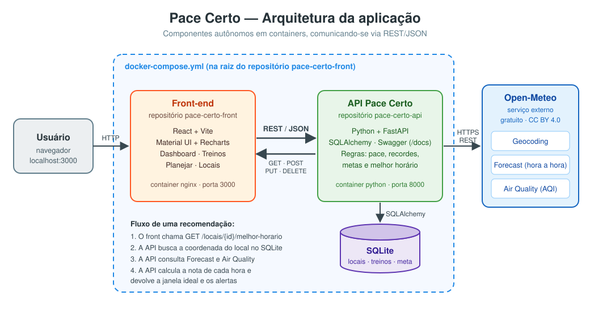

# 🏃 Pace Certo

**Pace Certo** é um diário de corrida que ajuda o corredor a **registrar treinos**, **acompanhar sua
evolução** (pace, volume semanal, recordes e metas) e **descobrir o melhor horário para correr**.
A recomendação considera a previsão do tempo hora a hora e a qualidade do ar.

**O problema:** quem corre ao ar livre sofre com calor, sol forte, chuva e poluição, e muitas vezes
decide o horário "no chute". Além disso, o histórico de treinos costuma ficar espalhado entre
aplicativos e anotações. O Pace Certo junta as duas coisas: **planejar com base no clima** e
**acompanhar a evolução** em um só lugar.

Este repositório é o **componente principal** do MVP: a interface web. Ele consome a
[API Pace Certo](https://github.com/Ptmarinho/pace-certo-api), que por sua vez integra o serviço
externo [Open-Meteo](https://open-meteo.com).

---

## 📐 Arquitetura



| Componente | Repositório | Tecnologia | Porta |
|---|---|---|---|
| **Interface** (este) | `pace-certo-front` | React 19, Vite, Material UI, Recharts, Nginx | 3000 |
| **API** | [`pace-certo-api`](https://github.com/Ptmarinho/pace-certo-api) | Python, FastAPI, SQLAlchemy, SQLite | 8000 |
| **Serviço externo** | [Open-Meteo](https://open-meteo.com) | API REST pública | — |

**Estratégia de comunicação:** o navegador chama a API via **REST/JSON** usando `GET`, `POST`, `PUT` e
`DELETE`. A API é a única que conversa com a Open-Meteo (HTTPS/REST). Ela trata os dados e devolve
uma resposta pronta para exibir. O usuário **nunca é redirecionado** para outro site.

---

## 🖥️ Telas e chamadas à API

| Tela | O que faz | Chamadas à API |
|---|---|---|
| **Dashboard** | Cards de resumo, meta semanal com barra de progresso, gráficos de volume semanal, evolução do pace e km por tipo, recordes e próximo treino | `GET /estatisticas` · `PUT /meta` |
| **Treinos** | Tabela com filtros (status, tipo, local e período), ordenação por coluna e paginação. Permite criar, editar, marcar como realizado e excluir, com cálculo do pace em tempo real | `GET /treinos` · `POST /treinos` · `PUT /treinos/{id}` · `DELETE /treinos/{id}` · `GET /locais` |
| **Planejar** | Escolha de local, dia (próximos 8 dias) e duração. Mostra a **janela ideal**, alertas ("evite das 10h às 18h"), gráfico hora a hora e tabela de detalhes, com agendamento do treino em um clique | `GET /locais/{id}/melhor-horario` · `POST /treinos` |
| **Locais** | Cards com busca, filtro por tipo e paginação. O cadastro busca a cidade na Open-Meteo **através da API** | `GET /locais` · `GET /locais/buscar-cidade` · `POST /locais` · `PUT /locais/{id}` · `DELETE /locais/{id}` |

**Recursos de interface:** gráficos interativos (Recharts), cores por classificação do clima
(ideal, boa, atenção, evitar), mensagens de sucesso e erro (snackbars), indicadores de carregamento,
diálogos de confirmação e layout responsivo para celular.

---

## 🌦️ API externa: Open-Meteo

| Item | Informação |
|---|---|
| Site | https://open-meteo.com |
| Documentação | https://open-meteo.com/en/docs |
| Custo | Gratuita para uso não comercial (até 10.000 chamadas/dia) |
| Cadastro / chave | **Não é necessário** cadastro nem chave de API |
| Licença dos dados | [CC BY 4.0](https://creativecommons.org/licenses/by/4.0/). É obrigatório citar a Open-Meteo como fonte (feito no rodapé da interface) |

**Rotas utilizadas (consumidas pela API Pace Certo):**

| Rota | Finalidade |
|---|---|
| `https://geocoding-api.open-meteo.com/v1/search` | Busca de cidades e coordenadas no cadastro de locais |
| `https://api.open-meteo.com/v1/forecast` | Previsão hora a hora: temperatura, sensação térmica, chance de chuva, UV, vento e umidade |
| `https://air-quality-api.open-meteo.com/v1/air-quality` | Índice de qualidade do ar (US AQI) |

A API transforma esses dados em uma **nota de 0 a 100 para cada hora**. Os detalhes do cálculo estão no
[README da API](https://github.com/Ptmarinho/pace-certo-api#como-a-nota-de-cada-hora-é-calculada).

---

## 🚀 Como executar

### Opção 1: aplicação completa com Docker Compose (recomendado)

Pré-requisitos: [Git](https://git-scm.com/) e [Docker Desktop](https://docs.docker.com/get-docker/).

```bash
# 1. Clone os dois repositórios lado a lado
git clone https://github.com/Ptmarinho/pace-certo-api.git
git clone https://github.com/Ptmarinho/pace-certo-front.git

# 2. Suba a aplicação a partir do repositório do front
cd pace-certo-front
docker compose up --build
```

| Serviço | Endereço |
|---|---|
| Interface | http://localhost:3000 |
| API (Swagger) | http://localhost:8000/docs |

A API sobe com **dados de demonstração** (locais e 8 semanas de treinos). Para parar, use
`docker compose down`. Para apagar também os dados, use `docker compose down -v`.

### Opção 2: somente o front-end com Docker

Com a API já rodando em `http://localhost:8000`:

```bash
docker build -t pace-certo-front .
docker run -d --name pace-certo-front -p 3000:80 pace-certo-front
```

Para outra URL de API: `docker build --build-arg VITE_API_URL=http://meu-servidor:8000 -t pace-certo-front .`

### Opção 3: ambiente de desenvolvimento (sem Docker)

Pré-requisitos: [Node.js 20.19+ ou 22+](https://nodejs.org/) e a API rodando em `http://localhost:8000`.

```bash
npm install
cp .env.example .env      # opcional: altere VITE_API_URL se necessário
npm run dev
```

Acesse http://localhost:5173.

| Script | Descrição |
|---|---|
| `npm run dev` | Servidor de desenvolvimento com recarga automática |
| `npm run build` | Gera a versão de produção em `dist/` |
| `npm run preview` | Serve localmente a versão de produção |

---

## 🗂️ Estrutura do projeto

```
pace-certo-front/
├── public/favicon.svg
├── src/
│   ├── main.jsx                  # Ponto de entrada (tema, roteamento, feedback)
│   ├── App.jsx                   # Definição das rotas
│   ├── theme.js                  # Tema do Material UI
│   ├── services/api.js           # Chamadas REST à API Pace Certo
│   ├── context/FeedbackContext.jsx
│   ├── utils/                    # Constantes e formatadores (pace, duração, datas)
│   ├── components/               # Componentes reutilizáveis
│   │   ├── Layout.jsx
│   │   ├── StatCard.jsx
│   │   ├── MetaSemanalCard.jsx
│   │   ├── VolumeSemanalChart.jsx
│   │   ├── EvolucaoPaceChart.jsx
│   │   ├── DistribuicaoTiposChart.jsx
│   │   ├── PrevisaoHorariaChart.jsx
│   │   ├── TreinoFormDialog.jsx
│   │   ├── LocalFormDialog.jsx
│   │   ├── ConfirmDialog.jsx
│   │   └── CarregandoConteudo.jsx
│   └── pages/                    # Telas
│       ├── DashboardPage.jsx
│       ├── TreinosPage.jsx
│       ├── PlanejarPage.jsx
│       └── LocaisPage.jsx
├── docs/arquitetura.svg          # Diagrama da arquitetura
├── Dockerfile                    # Build (Node) + servidor (Nginx)
├── nginx.conf
├── docker-compose.yml            # Sobe API + interface
└── package.json
```

---

## 📄 Créditos

- Dados meteorológicos e de qualidade do ar: [Open-Meteo.com](https://open-meteo.com/) (CC BY 4.0)
- Projeto desenvolvido como MVP da disciplina de Arquitetura de Software
